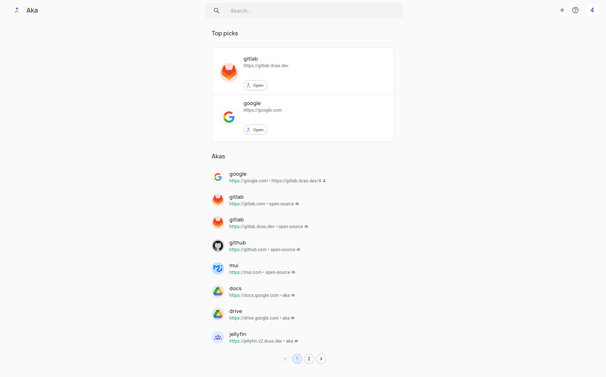

# AKA

> URL-shortener and search shortcut application.

Aka is an application for creating shortcuts that you can then quickly access via your browsers address bar.
For example, "aka git" can quickly take you to GitHub.



## Features

* OpenID Connect authentication
* `x509` authentication
* Personal links
* Group links
* Public links

## Installation

Prerequisites:

* PostgreSQL database. We generally test with the latest version, however any supported version (`>=11`) should work fine.
* (*recommended*) Kubernetes. You can use any container-based solution, however we only support Kubernetes-based deployment methods
* OpenID Connect provider

TODO

## Development

We recommend using Minikube as your development environment.

Create a Kubernetes secret that contains information about your OIDC provider:

```shell
kubectl create secret oidc \
    --from-literal=OIDC_ISSUER_URL=https://oidc.example.com \
    --from-literal=OIDC_CLIENT_ID=my-client-id \
    --from-literal=OIDC_CLIENT_SECRET=my-client-secret \
    --from-literal=OIDC_REDIRECT_URL=https://aka.devel/auth/callback
```

Deploy the database and API:

```shell
cd aka-api/
skaffold run
```

Start the UI development server:

```shell
cd aka-ui/
npm ci
npm run start
```

The application will now be accessible at `http://localhost:3000`
